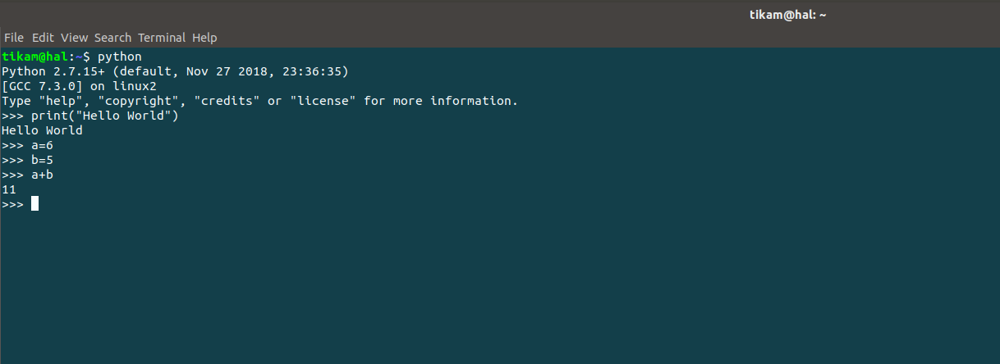
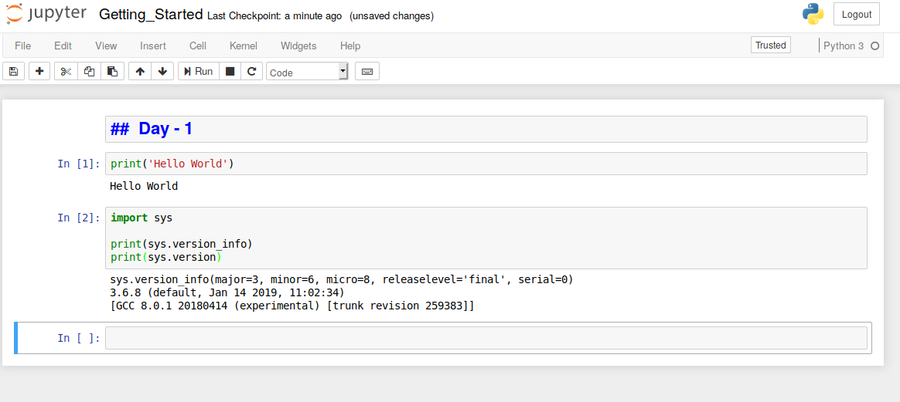

## Getting to know Python

### Introduction to Python

#### Python history

1. Christmas 1989: Guido von Rossum began writing compilers for the Python language.
2. February 1991: The first Python compiler (also an interpreter) was born, which was implemented in C (there were Java and C# implementations of Jython and IronPython, and PyPy, Brython, Pyston, etc.). Other implementations), you can call library functions in C language. In the earliest versions, Python already provided support for building blocks such as "class", "function", "exception handling", and provided core data types such as "list" and "dictionary", while supporting module-based. To construct an application.
3. January 1994: Python 1.0 is officially released.
4. October 16, 2000: Python 2.0 released, adding a complete [garbage collection] (https://en.wikipedia.org/wiki/%E5%9E%83%E5%9C%BE%E5% 9B%9E%E6%94%B6_(%E8%A8%88%E7%AE%97%E6%A9%9F%E7%A7%91%E5%AD%B8)), provided for [Unicode]( Support for https://zh.wikipedia.org/wiki/Unicode). At the same time, the entire development process of Python is more transparent, the community's influence on the development progress is gradually expanding, and the ecosystem is slowly forming.
5. December 3, 2008: Python 3.0 is released, it is not fully compatible with previous Python code, but because there are still many companies using Python 2.x in projects and operations, Python 3.x Many new features were later ported to Python 2.6/2.7.

The version of Python 3.7.x we are currently using is released in 2018. The version number of Python is divided into three sections, which are shaped like ABC. Where A indicates the large version number, generally when the overall rewrite, or the change is not backward compatible, increase A; B indicates the function update, increase B when new features appear; C indicates small changes (for example: fix a certain Bug), increase C as long as there is a change. If you are interested in the history of Python, you can read a blog post titled "A Brief History of Python" (http://www.cnblogs.com/vamei/archive/2013/02/06/2892628.html).

#### Advantages and disadvantages of Python

The advantages of Python are many, and the simple ones can be summarized as follows.

1. Simple and clear, there is only one way to do one thing.
2. The learning curve is low, and Python is easier to use than many other languages.
3. Open source, with a strong community and ecosystem.
4. Interpretative language, inherently platform portable.
5. Support for both mainstream programming paradigms (object-oriented programming and functional programming).
6. Extensibility and embeddability, you can call C / C + + code, you can also call Python in C / C + +.
7. The code is highly standardized and readable, suitable for people with code cleanliness and obsessive-compulsive disorder.

The shortcomings of Python are mainly focused on the following points.

1. Execution efficiency is slightly lower, so computationally intensive tasks can be written in C/C++.
2. The code can't be encrypted, but now many companies don't sell software but sell services. This problem will be diluted.
3. There are too many frameworks to choose from during development (for example, there are more than 100 web frameworks), and there are errors in the choices.

#### Python application area

At present, Python has a wide range of applications in Web application development, cloud infrastructure, DevOps, web crawler development, data analysis mining, machine learning, etc., so it also produces Web back-end development, data interface development, automated operation and maintenance, and automated testing. A range of positions in scientific computing and visualization, data analysis, quantitative trading, robot development, image recognition and processing.

### Building a programming environment

#### Windows Environment

You can download the Python Windows installer (exe file) from [Python's official website] (https://www.python.org). Note that if you install Python 3.x in Windows 7, you need to install Service first. Pack 1 patch package (can be installed by some tool software to automatically install the system patch function), the installation process is recommended to check "Add Python 3.x to PATH" (add Python 3.x to the PATH environment variable) and select custom Installation, in the "Optional Features" interface, it is best to check "pip", "tcl/tk", "Python test suite" and so on. It is highly recommended to choose a custom installation path and ensure that there is no Chinese in the path. When the installation is complete, you will see the prompt "Setup was successful". If you run the Python program later, the problem that the Python interpreter won't work due to missing some dynamic link library files can be solved as follows.

If the system shows that the api-ms-win-crt\*.dll file is missing, you can refer to ["api-ms-win-crt\*.dll missing cause analysis and solution"] (<https://zhuanlan.zhihu. Com/p/32087135>) A textual explanation of the method to deal with or directly download the Visual C++ Redistributable for for [Microsoft's official website] (https://www.microsoft.com/en-us/download/details.aspx?id=48145) Visual Studio 2015 file is fixed; if it is caused by missing some dynamic link library files after updating Windows DirectX, you can download a [DirectX Repair Tool] (<https://dl.pconline.com.cn/download/360074 -1.html>) Fix it.

#### Linux Environment

The Linux environment comes with Python 2.x, but if you want to update to the 3.x version, you can download the Python source code and pass the source code on [Python's official website] (https://www.python.org). Install the installation method, the specific steps are as follows.

Install dependent libraries (because these dependent libraries may fail when the source code artifacts are installed because of missing the underlying dependencies).

```Shell
Yum -y install wget gcc zlib-devel bzip2-devel openssl-devel ncurses-devel sqlite-devel readline-devel tk-devel gdbm-devel db4-devel libpcap-devel xz-devel libffi-devel
```

Download the Python source code and extract it to the specified directory.

```Shell
Wget https://www.python.org/ftp/python/3.7.3/Python-3.7.3.tgz
Xz -d Python-3.7.3.tar.xz
Tar -xvf Python-3.7.3.tar
```

Switch to the Python source directory and execute the following commands to configure and install.

```Shell
Cd Python-3.7.3
./configure --prefix=/usr/local/python37 --enable-optimizations
Make && make install
```

Modify the file named .bash_profile in the user's home directory, configure the PATH environment variable and make it take effect.

```Shell
Cd ~
Vim .bash_profile
```

```Shell
# ... omitting the above code here...

Export PATH=$PATH:/usr/local/python37/bin

# ... The following code is omitted here...
```

Activate the environment variable.

```Shell
Source .bash_profile
```

#### macOS Environment

macOS also comes with Python 2.x version, which can be installed via the installation file (pkg file) provided by [Python's official website] (https://www.python.org). After the default installation is complete, you can launch the 2.x version of the Python interpreter by executing the python command on the terminal. You can launch the 3.x version of the Python interpreter by executing the python3 command.

### Running Python programs from the terminal

#### Confirming the Python version

You can type the following command from a Windows command prompt.

```Shell
Python --version
```
Or type the following command in the terminal of a Linux or macOS system.

```Shell
Python3 --version
```

Of course, you can also enter python or python3 into the interactive environment, and then execute the following code to check the Python version.

```Python
Import sys

Print(sys.version_info)
Print(sys.version)
```

#### Writing Python source code

You can use text editing tools (recommended [Sublime] (<https://www.sublimetext.com/>), [Atom] (<https://atom.io/>), [Visual Studio Code] (<https ://code.visualstudio.com/>) and other advanced text editing tools) Write the Python source code and save the file with py as the extension. The code content is as follows.

```Python
Print('hello, world!')
```

#### Running the program

Switch to the directory where the source code is located and execute the following command to see if "hello, world!" is output on the screen.

```Shell
Python hello.py
```

or

```Shell
Python3 hello.py
```

### Comments in the code

Annotation is an important part of the programming language. It is used to explain the function of the code in the source code to enhance the readability and maintainability of the program. Of course, the code segment in the source code that does not need to participate in the operation can be removed by comments. This is often used when debugging programs. Comments are removed when the source code enters the preprocessor or compiles, and are not retained in the target code and do not affect the execution results of the program.

1. Single line comment - part beginning with # and space
2. Multi-line comments - three quotes at the beginning, three quotes at the end

```Python
"""
The first Python program - hello, world!
Pay tribute to the great Mr. Dennis M. Ritchie

Version: 0.1
Author: Luo Wei
"""

Print('hello, world!')
# print("Hello, the world!")
Print('hello', 'world')
Print('hello', 'world', sep=', ', end='!')
Print('goodbye, world', end='!\n')
```

### Other tools introduction

#### IDLE - Built-in integrated development tools

IDLE is an integrated development tool that comes with the Python environment, as shown in the following figure. But because IDLE's user experience is not so good, it is rarely used in actual development.


#### IPython - Better interactive programming tools

IPython is a Python-based interactive interpreter. IPython provides more powerful editing and interaction features than the native Python interactive environment. IPython and Jupyter can be installed via Python's package management tool pip, as shown below.

```Shell
Pip install ipython
```

or

```Shell
Pip3 install ipython
```

After the installation is successful, you can start IPython with the following ipython command, as shown in the following figure.



Of course, we can also perform interactive code writing in a browser window by installing the Jupyter tool and running a program called a notebook.

```Shell
Pip install jupyter
```

or

```Shell
Pip3 intall jupyter
```

Then execute the following command:

```Shell
Jupyter notebook
```




#### Sublime / Visual Studio Code - Advanced Text Editor


- First install Sublime 3 or Sublime 2 via the [Official Website] (https://www.sublimetext.com/) download installer.

- Install package management tools.
  1. Open the console with the shortcut key Ctrl+` or select Show Console in the View menu and enter the code below.

  - Sublime 3

  ```Python
  Import urllib.request,os;pf='Package Control.sublime-package';ipp=sublime.installed_packages_path();urllib.request.install_opener(urllib.request.build_opener(urllib.request.ProxyHandler()));open( Os.path.join(ipp,pf),'wb').write(urllib.request.urlopen('http://sublime.wbond.net/'+pf.replace(' ','%20')) .read())
  ```
  - Sublime 2

  ```Python
  Import urllib2,os;pf='Package Control.sublime-package';ipp=sublime.installed_packages_path();os.makedirs(ipp)ifnotos.path.exists(ipp)elseNone;urllib2.install_opener(urllib2.build_opener(urllib2. ProxyHandler()));open(os.path.join(ipp,pf),'wb').write(urllib2.urlopen('http://sublime.wbond.net/'+pf.replace(' ', '%20')).read());print('Please restart Sublime Text to finish installation')
  ```
  2. Manually install the browser and type https://sublime.wbond.net/Package%20Control.sublime-package to download this file.
  After downloading, open sublime text, select menu Preferences->Browse Packages... Open the installation directory
  At this point, you will enter a directory called Packages, click to enter the sub-directory Sublime Text3, there is a folder called Installed Packages in this directory, put the files you just downloaded here. Then restart sublime text3 and see if there are two options, Package Settings and Package Control, at the bottom of the Preferences menu. If there is one, it means the installation is successful.


- Install the plugin. Open the command panel through the Package Control of the Preference menu or the shortcut key Ctrl+Shift+P. Enter the Install Package in the panel to find the tool to install the plugin, and then find the required plugin. We recommend that you install the following plugins:

  - SublimeCodeIntel - Code Completion Tool Plugin.
  - Emmet - front-end development code template plugin.
  - Git - Version Control Tool Plugin.
  - Python PEP8 Autoformat - PEP8 specification autoformatting plugin.
  - ConvertToUTF8 - Converts the local encoding to UTF-8.

> Description: In fact, Visual Studio Code may be a better choice, it does not cost money and provides more complete and powerful features, and interested readers can study it themselves.

#### PyCharm - Python Development Artifact

The installation, configuration, and use of PyCharm are described in [Playing PyCharm] (../Play PyCharm.md), and interested readers can choose to read.


### Exercise

1. Review the code results below in the Python interactive environment and try to translate the content into Chinese.

    ```Python
    Import this
    ```

    > Description: After typing the above command, I will see the output shown below in the interactive environment. This content is called "Zen of Python". The reason is not only applicable to Python, but also to other programming. Language.
    >

2. Learn to use the turtle to draw graphics on the screen.

    > Description: Turtle is a very interesting module built into Python. It is especially suitable for children to understand what programming is. It was originally part of the Logo language. The Logo language was the programming language invented by Wally Feurzig and Seymour Papert in 1966.

    ```Python
    Import turtle
    
    Turtle.pensize(4)
    Turtle.pencolor('red')
    Turtle.forward(100)
    Turtle.right(90)
    Turtle.forward(100)
    Turtle.right(90)
    Turtle.forward(100)
    Turtle.right(90)
    Turtle.forward(100)
    Turtle.mainloop()
    ```
